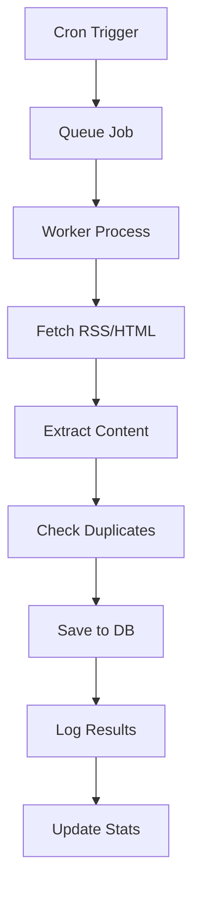

# 🚀 RSS Aggregator - Beta Versija

## 📋 Beta Funkcionalumų Sąrašas

### ✅ Implementuota

#### 1. **PostgreSQL Migracija**
- SQLite → PostgreSQL perėjimas
- Docker Compose konfigūracija
- Geresnis performance ir scalability
- Concurrent access palaikymas

#### 2. **Job Queue (BullMQ)**
- Redis pagrindu job queue sistema
- Prioritetai ir retry mechanizmas
- Recurring job'ai (kas 15 min / 4 val)
- Concurrency control (3 vienu metu)
- Realaus laiko monitoring

#### 3. **Pilno Teksto Ištraukimas**
- JSDOM pagrindu HTML parsing
- Automatinis straipsnių turinio gavimas
- Konfigūruojamas per `extractFullText` lauką
- Smart detection (summary vs full content)

#### 4. **Patobulinta Duplicate Detection**
- Dviguba apsauga: `hash` + `urlHash`
- URL + title kombinacijos hash'as
- Geriau atpažįsta dublikatus
- Performance optimizacija

#### 5. **Monitoring & Analytics**
- IngestLog lentelė visoms operacijoms
- Admin dashboard su statistikomis
- Queue stats realaus laiko
- Health check endpoint
- Error tracking ir logging

#### 6. **PWA (Progressive Web App)**
- Service Worker su offline palaikymu
- App manifest
- Install prompt
- Background sync
- Push notifications ready
- Offline page

#### 7. **Docker & DevOps**
- Docker Compose setup
- PostgreSQL + Redis servisai
- Adminer DB valdymas
- Environment konfigūracija
- Automated setup script

## 🛠️ Technologijų Stack

### Backend
- **Next.js 14** - Full-stack framework
- **PostgreSQL 15** - Duomenų bazė
- **Redis 7** - Job queue ir caching
- **BullMQ** - Job queue management
- **Prisma** - ORM su migracijomis
- **JSDOM** - HTML parsing

### Frontend
- **React 18** - UI framework
- **Tailwind CSS** - Styling
- **PWA** - Progressive Web App
- **Service Worker** - Offline functionality

### DevOps
- **Docker Compose** - Container orchestration
- **Adminer** - Database management
- **Health Checks** - Monitoring

## 🚀 Quick Start

### 1. Automated Setup
```bash
# Paleisti setup script'ą
./scripts/setup-beta.sh
```

### 2. Manual Setup
```bash
# 1. Install dependencies
npm install

# 2. Start services
docker-compose up -d

# 3. Setup database
npx prisma generate
npx prisma migrate dev --name beta_features
npm run prisma:seed

# 4. Start development
npm run dev
```

## 📊 Admin Dashboard

Prieiga: `http://localhost:3000/admin/dashboard`

### Funkcionalumai:
- **Overview Stats**: Total articles, sources, queue jobs
- **Queue Statistics**: Real-time job monitoring
- **Recent Ingestions**: Success/error tracking
- **Top Sources**: Most productive sources
- **Performance Metrics**: Duration, throughput

## 🔧 API Endpoint'ai

### Queue Management
```bash
# Pridėti job'ą į queue
POST /api/queue/ingest
{
  "sourceId": "source-id",
  "priority": 10
}

# Queue statistikos
GET /api/queue/stats
```

### Monitoring
```bash
# Dashboard duomenys
GET /api/admin/dashboard

# Sistemos būsena
GET /api/health
```

### Pilno Teksto
```bash
# Rankinis pilno teksto ištraukimas
POST /api/articles/[id]/extract
```

## 🐳 Docker Servisai

| Servisas | Port | Aprašymas |
|----------|------|-----------|
| **app** | 3000 | Next.js aplikacija |
| **db** | 5432 | PostgreSQL duomenų bazė |
| **redis** | 6379 | Redis (BullMQ) |
| **adminer** | 8080 | DB valdymas |

## 📈 Performance

### Job Queue
- **Concurrency**: 3 vienu metu ingest job'ai
- **Rate Limiting**: 500ms delay tarp request'ų
- **Retry Logic**: Exponential backoff
- **Priority System**: High-priority sources kas 15 min

### Database
- **PostgreSQL**: Concurrent access
- **Indexes**: Optimized queries
- **Connection Pooling**: Efficient resource usage

### Caching
- **ETag/Last-Modified**: HTTP caching
- **Service Worker**: Offline caching
- **Redis**: Job queue persistence

## 🔐 Security

- **Admin Token**: API autentifikacija
- **CSRF Protection**: Form security
- **XSS Prevention**: Input sanitization
- **Rate Limiting**: Request throttling
- **Input Validation**: Zod schemas

## 📱 PWA Funkcionalumai

### Offline Support
- **Service Worker**: Background sync
- **Cached Resources**: Static files
- **Offline Page**: User-friendly fallback
- **Background Sync**: Queue offline actions

### App Installation
- **Install Prompt**: Native app experience
- **App Manifest**: PWA configuration
- **Icons**: Custom app icons
- **Splash Screen**: Loading experience

### Notifications
- **Push Ready**: Notification system
- **Background Sync**: Offline actions
- **User Actions**: Interactive notifications

## 🔄 Job Queue Workflow



## 📊 Monitoring Dashboard

### Real-time Metrics
- **Queue Status**: Waiting, active, completed, failed
- **Ingestion Stats**: Items found, created, duration
- **Error Tracking**: Failed jobs, error messages
- **Performance**: Response times, throughput

### Historical Data
- **Daily Stats**: Articles created per day
- **Source Performance**: Top sources by article count
- **Error Trends**: Failure patterns over time

## 🚨 Troubleshooting

### Common Issues

#### Redis Connection
```bash
# Patikrinti Redis
docker-compose logs redis

# Restart Redis
docker-compose restart redis
```

#### Database Issues
```bash
# Patikrinti PostgreSQL
docker-compose logs db

# Reset database
docker-compose down -v
docker-compose up -d
npx prisma migrate dev
```

#### Queue Issues
```bash
# Patikrinti queue stats
curl -H "Authorization: Bearer YOUR_TOKEN" \
  http://localhost:3000/api/queue/stats
```

### Health Checks
```bash
# Sistemos būsena
curl http://localhost:3000/api/health

# Database connection
curl http://localhost:3000/api/admin/dashboard
```

## 🔮 Ateities Plėtra

### Production Ready
- [ ] Multi-user authentication
- [ ] Role-based access control
- [ ] Advanced security hardening
- [ ] Load balancing
- [ ] CDN integration

### Advanced Features
- [ ] Machine learning recommendations
- [ ] Advanced search with Elasticsearch
- [ ] Real-time notifications
- [ ] Mobile app (React Native)
- [ ] API rate limiting

### DevOps
- [ ] Kubernetes deployment
- [ ] CI/CD pipeline
- [ ] Monitoring with Prometheus
- [ ] Logging with ELK stack
- [ ] Backup automation

## 📚 Dokumentacija

- **BETA_SETUP.md** - Detalus setup gidas
- **API Documentation** - Endpoint'ai ir pavyzdžiai
- **Database Schema** - Prisma modeliai
- **Docker Configuration** - Container setup

## 🤝 Contributing

1. Fork repository
2. Create feature branch
3. Implement changes
4. Add tests
5. Submit pull request

## 📄 License

MIT License - see LICENSE file for details

---

**Beta versija suteikia pilną funkcionalumą production-ready RSS agregatoriaus su modernia architektūra, monitoring'u ir PWA palaikymu.**
